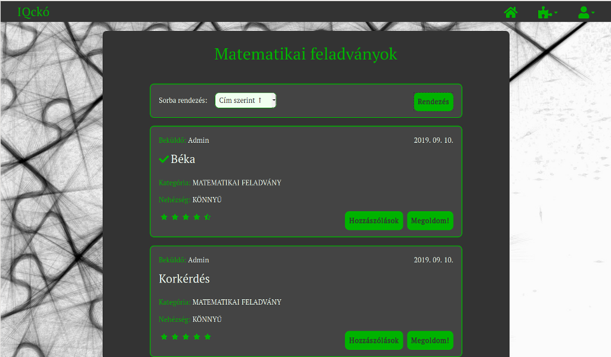
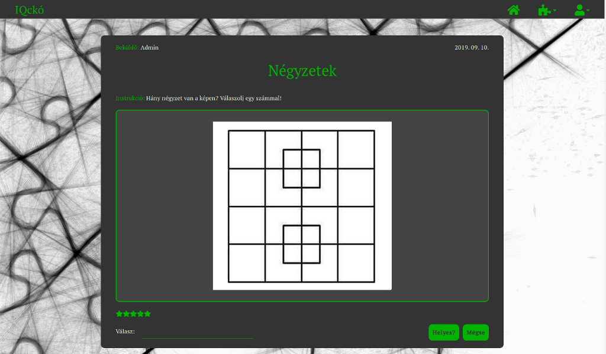

# IQckó
## - a web application to play logic puzzles

### Pet project: Java (Spring Boot) app with Angular front-end

The Hungarian-language web app is meant to be used by people who enjoy solving various types of logic puzzles ranging from very easy to rather difficult ones.
Players can solve, rate and comment on the riddles and games; moreover, they can create their own puzzles.
By collecting points for correct solutions, the users also compete for having a high-ranking position on the leaderboard.

### Technologies
* Backend
  * Java 11 SE
  * Spring Boot
  * REST API template
  * PostgreSQL
  * JPA
  * Hibernate
  * Spring Security
  * Lombok
  * Mockito
  * Junit5
  
* Frontend
  * Angular 8
  * TypeScript
  * HTML5
  * CSS3
  * Bootstrap 4
  
* git
